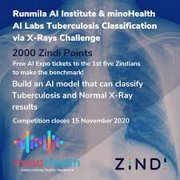

# ZindiTuberculosisClassification
This is a solution for classifiying Xrays containing tuberculosis symptoms or not.
I has been done for a challenge hosted by the biggest african data science platform : [zindi africa](https//www.zindi.africa).

    

 

# Description

 

Tuberculosis (TB) is the ninth leading cause of death worldwide. In 2016, an estimated 417,000 people died from Tuberculosis in Africa, and 1.7 million globally. In South Africa Tuberculosis is the leading cause of death with 450,000 people developing the disease every year and 89,000 people dying from it. That’s ten people every hour.

With over 800,000 confirmed cases and 18,000 deaths recorded in Africa and over 17 million confirmed cases and 670,000 recorded deaths globally as of August 2, 2020, the COVID-19 global pandemic continues to take a heavy toll around the world. In countries with a high prevalence level of TB, TB can create additional complexity to the COVID-19 response. And by the same token, COVID-19 is adding new complexity to the ongoing battle against TB.

For both TB and COVID-19 patients, medical imaging (Chest X-Rays and/or CT Scans) can sometimes be performed to identify and manage any chest abnormalities that may develop.

This challenge asks you to build an AI model that can classify Tuberculosis and Normal X-Ray results. With Tuberculosis infections still active as the COVID-19 pandemic continues, an automated tool to help identify TB has the potential to reduce hospital workload and optimize patient care during a time when hospitals are being overwhelmed by COVID-19 cases.

 

## Disclaimer 

This challenge is solely for educational purposes. Chest X-Rays is one of various tools that can be used for triaging and screening for Tuberculosis. Furthermore, it is possible for an individual to develop different types of infections. This is to be treated purely as an exercise in tool development.

One potential follow up of this research is the detection of specific chest abnormalities associated with either COVID-19 or Tuberculosis, which could help in the development of personalised treatment for patients. Promising projects are eligible, but not guaranteed for additional mentoring into a publication.

 

# Acknowledgements

Montgomery County X-ray Set: X-ray images in this data set have been acquired from the tuberculosis control program of the Department of Health and Human Services of Montgomery County, MD, USA.

Shenzhen Hospital X-ray Set: X-ray images in this data set have been collected by Shenzhen No.3 Hospital in Shenzhen, Guangdong province, China. The x-rays were acquired as part of the routine care at Shenzhen Hospital.

It is requested that publications resulting from the use of this data attribute the source (National Library of Medicine, National Institutes of Health, Bethesda, MD, USA and Shenzhen No.3 People’s Hospital, Guangdong Medical College, Shenzhen, China) and cite the following publications:

Jaeger S, Karargyris A, Candemir S, Folio L, Siegelman J, Callaghan F, Xue Z, Palaniappan K, Singh RK, Antani S, Thoma G, Wang YX, Lu PX, McDonald CJ. Automatic tuberculosis screening using chest radiographs. IEEE Trans Med Imaging. 2014 Feb;33(2):233-45. doi: 10.1109/TMI.2013.2284099. PMID: 24108713
Candemir S, Jaeger S, Palaniappan K, Musco JP, Singh RK, Xue Z, Karargyris A, Antani S, Thoma G, McDonald CJ. Lung segmentation in chest radiographs using anatomical atlases with nonrigid registration. IEEE Trans Med Imaging. 2014 Feb;33(2):577-90. doi: 10.1109/TMI.2013.2290491. PMID: 24239990
About [minoHealth](runchbase.com/organization/minohealth)

 

# About MinoHealth 

minoHealth is a startup and multifaceted system with the objective of democratising Quality Healthcare with innovative and cutting edge technologies like Artificial Intelligence, (Big) Data Analytics and Cloud computing in Africa. minoHealth‘s AI Research lab, minoHealth AI Labs researches and experiments with Artificial Intelligence and ways it can be applied to Healthcare to make it faster, better and yet cheaper. They research and apply Artificial Intelligence to fields like Biotechnology, Neuroscience, Optometry, Epidemiology and Dietetics/Nutrition. Their research projects include ‘ScaffoldNet: Detecting and Classifying Biomedical Polymer-Based Scaffolds via a Convolutional Neural Network’, published in the Scientific Book, “Advances In Information and Communication” and “End-to-End Learning via a Convolutional Neural Network for Cancer Cell Line Classification” published in Journal of Industry - University Collaboration. Their ongoing research projects also includes a collaboration with West African Centre for Cell Biology of Infectious Pathogens (WACCBIP) on the use of Machine Learning in the identification of a multivariate signature for Malaria Immunity. They are members of Massachusett Institute of Technology (MIT)'s Global ​BioSummit Community. They are also the lead for the Topic Group on Artificial Intelligence for Radiology, under the United Nations International Telecommunication Union (ITU) and World Health Organization (WHO) Focus Group on Artificial Intelligence for Health (FG-AI4H). minoHealth’s platform was listed in AppsAfrica’s ‘5 African innovations disrupting traditional sectors’.

About Runmila AI Institute [Runmila web page](runmilainstitute.com)

reRunmila AI Institute is dedicated to preparing Ghana, and the rest of Africa for an Artificial Intelligence (AI) Future and the 4th Industrial Revolution. The world is drastically changing with all leading nations and blocs creating AI Plans & Strategies. Furthermore, plenty of these leading nations and blocs have already started implementing these strategies; Africa shouldn't be left behind. Through the skillful use of AI, we can leapfrog our development and solve many of Africa's grand challenges, especially connected to the 'Sustainable Development Goals (SDGs)'. Our goal is to train the talents that Africa requires to build this AI Future that the continent deserves and needs. We are doing this by equipping Africans, starting with Ghanaians, with practical skills in AI (Deep Learning & Machine Learning) and Data Science.

Our courses and workshops are practical, being Development-focused and designed around optimally teaching complex concepts in a fast and easy-to-grasp approach. Our students take away skills to develop their own AI projects that they can readily implement for their needs and demonstrate to would-be investors or employers. These courses and workshops are crafted by Artificial Intelligence Engineers and Researchers who are already working on real world applications of Artificial Intelligence in Africa.

 

# Timeline 

Competition closes on 15 November 2020.

 

# Evaluation metric 

The evaluation metric for this competition is the Area Under the ROC curve (AUC) [1].

 

# Datasets

The data have been split into a test and training set. The training set, on which you will train your models, contains **353 images of x-rays of TB-positive lungs and 365 images of x-rays of healthy lungs**. The test set contains **82 images**.

    <a href="https://zindi.africa/competitions/runmila-ai-institute-minohealth-ai-labs-tuberculosis-classification-via-x-rays-challenge/data" class="button primary">Download datasets</a>

 

# Our approach
-  Architectures

    We experimeted 3 architectures to get a baseline from pretained models:

    * resnet[2] (50, 101, 152)
    * densenet[3] (121, 161)
    * efficientnet[4] (B0, b, B3, B4)

 

-  Training process

    We used a k-Fold cross validation (with k=10) to get a more stable output from our model predictions.

    * 10-folds cros validation
    * 15 epochs per fold
    * Images shapes (300, 300, 3), (350, 350, 3), (224, 224, 3), (256, 256, 3)
    * Training batch sizes : 4,8,16,32
    * Validation batch sizes : 4, 8, 16 

 

-  Inference
    * Ensemble of 10 models
    * Average predictions

- **Final solution** 
    * **./Notebooks/TB0-final-torch.ipynb** 
    
    * code runable on [google colab](https://colab.research.google.com/) with datasets uploaed in google drive.

 

# Final results

At the end of the competition we score AUC ~ 0.9761 (before code review).
**Ranked** : 8th / 104

<a href="https://zindi.africa/competitions/runmila-ai-institute-minohealth-ai-labs-tuberculosis-classification-via-x-rays-challenge/leaderboard"> See leaderboard </a>

 

# Contributers 

    

Emmanuel KOUPOH | Cédric MANOUAN | Muhamed TUO
------------ | --------------|------------
[eaedk](https://github.com/eaedk) | [dric2018](https://github.com/dric2018)| [NazarioR9]('https://github.com/NazarioR9')
[Emmanuel on linkedin](https://www.linkedin.com/in/esaïe-alain-emmanuel-dina-koupoh-7b974a17a)| [Cedric on linkedin](https://www.linkedin.com/in/cédric-pascal-emmanuel-manouan-ba9ba1181)| [Muhamed on linkedin](https://www.linkedin.com/in/muhamed-tuo-b1b3a0162)
 

# Resources
 [Pytorch](https://pytorch.org/tutorials/beginner/transfer_learning_tutorial.html) 

 [Pytorch-lightning](https://pytorch-lightning.readthedocs.io/en/latest/transfer_learning.html)

 [Tensorflow](https://www.tensorflow.org/tutorials/images/transfer_learning) 

 [Keras](https://keras.io/guides/transfer_learning/)

 [1] [Area under the ROC curve ](https://en.wikipedia.org/wiki/Receiver_operating_characteristic)

 

 [2] [Deep residual learning for image recognition (Resnet), 2015, Kaiming He, Xiangyu Zhang, Shaoqing Ren, Jian Sun, Microsoft Research.](https://arxiv.org/pdf/1512.03385.pdf)

 

 [3] [Densely Connected Convolutional Networks (Densenet), 2018, Gao Huang, Zhuang Liu, Laurens van der Maaten, Cornell University, Tsinghua University, Facebook AI Research.](https://arxiv.org/pdf/1608.06993.pdf)

 

 [4] [EfficientNet : Rethinking Model Scaling for Convoutional Neural Networks, 2020, Mingxing Tan,  Quoc V. Le](https://arxiv.org/pdf/1905.11946.pdf)

